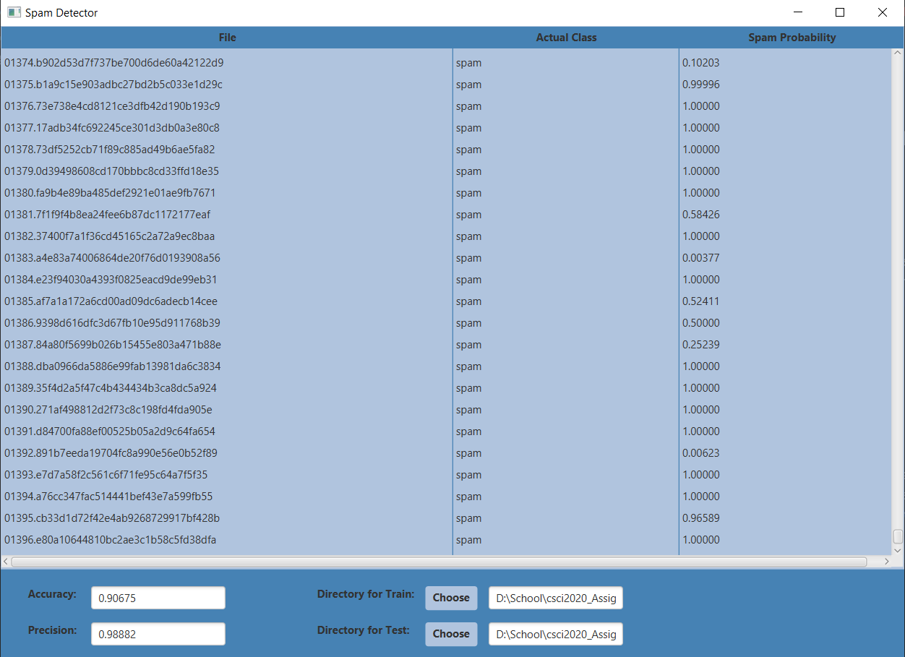

# ricky-shayne-assignment1-csci2020

# Project Information
This program takes files in a directory you select and does various 
probability calculations to determine if it is spam (do not want) or 
ham (want). It then outputs these files in a chart with their true 
type and the probability of it being spam according to the calculations 
done through your program.

# Improvements
Some improvements were made are thing such as using a directory selector
for choosing your train and test data by using file explorer. Other improvements include 
changing the design of the system to be light and dark blue, as well as
changing fonts to be bolded. The table also has every cell coloured in
the same blue design.

# How To Run
To use this program yourself you must first open up your cmd or other
similar program such as git bash and locate the folder you would like
to clone to. Secondly, use the command git clone [url] using the url
at the top of this browser page in the place of the bracketed url.
Your system must have a working jdk selected on your IDE of choice as 
well as a JavaFX jdk imported properly as a library to be used for the
project. You can then run it through your IDE like IntelliJ and the program
should pop up as a new window. You can then select your directories 
(train and test) using the choose buttons and after selecting both directories
the table should populate with data.

# Resources
https://www.javatpoint.com/java-map 

https://www.w3schools.com/java/java_user_input.asp

https://examples.javacodegeeks.com/java-io-ioexception/

http://tutorials.jenkov.com/javafx/directorychooser.html

https://www.baeldung.com/java-round-decimal-number

https://docs.oracle.com/javafx/2/api/javafx/scene/doc-files/cssref.html